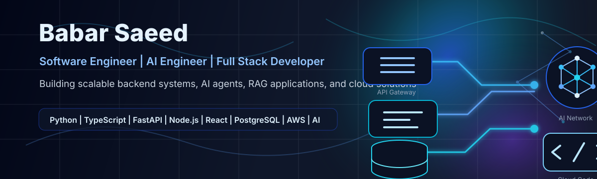

# Hi, I'm Babar Saeed

**Software Engineer | Backend & Full Stack Developer | AI Agents | RAG | Python | TypeScript | FastAPI | Node.js | React | AWS**

I build scalable backend systems, full-stack products, AI agents, RAG applications, and cloud-ready APIs. I enjoy turning real business problems into clean, reliable software that is easy to maintain and ready to grow.

Based in Karachi, Pakistan. Open to remote roles and worldwide relocation.

## What I Do

- Design and build backend services, REST APIs, authentication flows, and database-driven systems.
- Develop full-stack applications with React, Next.js, Node.js, FastAPI, and modern cloud tooling.
- Build AI-powered products using LLM workflows, AI agents, RAG, prompt engineering, and automation.
- Work across B2B integrations, JSON/EDI/XML translation, documentation, testing, and deployment.
- Use AI-assisted engineering tools to debug faster, generate better tests, and ship cleaner features.

## Core Tech

**Languages:** Python, TypeScript, JavaScript, Java, C#, SQL  
**Backend:** FastAPI, Node.js, Express.js, NestJS, REST APIs, authentication, microservices basics  
**Frontend:** React, Next.js, React Native, HTML, CSS  
**Databases:** PostgreSQL, MongoDB, MySQL, SQL Server, DynamoDB  
**Cloud & DevOps:** AWS, Lambda, S3, Docker, GitHub Actions, Firebase  
**AI:** AI Agents, RAG, LLM workflows, LangChain, Vertex AI, Gemini, OpenAI, Claude, prompt engineering  
**Tools:** Git, GitHub, Bitbucket, Jira, Postman, VS Code, Cursor, Codex, Kiro, Roo Code

## Featured Work

### AI Agents and RAG Applications
Built AI-assisted workflows and agentic applications using LLM tools, retrieval patterns, prompt engineering, and automation to solve practical product and engineering problems.

### Backend and Full-Stack Products
Developed backend APIs, database models, authentication, order workflows, admin features, and frontend/mobile interfaces for real-world software products.

### B2B Data Translation Workflows
Engineered Python-based integrations across JSON, EDI, and XML to improve API integrations and business data exchange reliability.

### AI Agent Challenge - HackerRank Orchestrate
Submitted an AI Agent solution for the May 2026 challenge, achieved 415th place, and earned a Certificate of Excellence.

## Current Focus

- Scalable backend architecture
- AI agents and RAG systems
- Cloud-native API development
- Product engineering for AI startups
- Clean engineering workflows with tests and documentation

## GitHub Stats

  

  

  

## Let's Connect

I am open to Software Engineer, Backend Engineer, Full Stack Developer, Python Engineer, Node.js Developer, React Developer, and AI Engineer opportunities.

